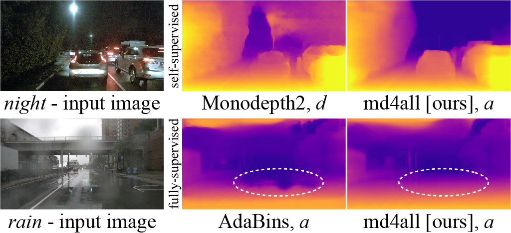
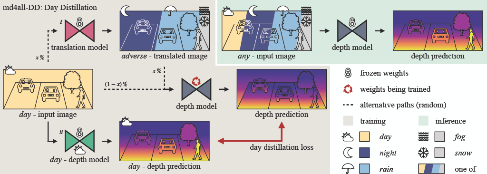
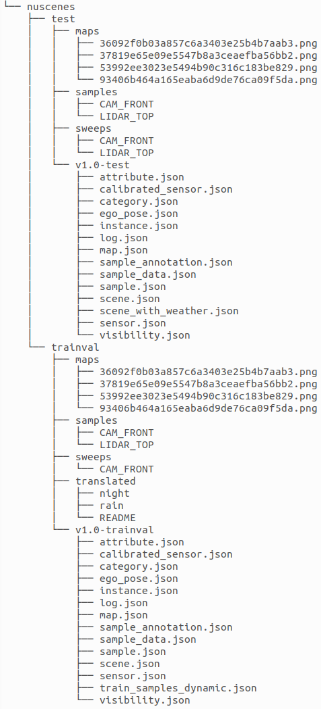
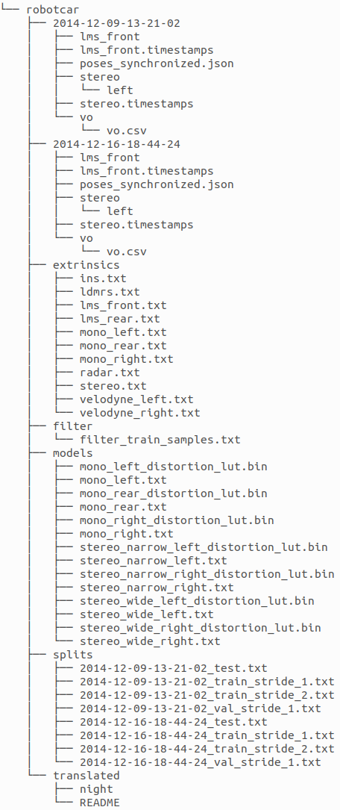

# md4all - ICCV 2023
Source code for the paper: [Robust Monocular Depth Estimation under Challenging Conditions](https://openaccess.thecvf.com/content/ICCV2023/html/Gasperini_Robust_Monocular_Depth_Estimation_under_Challenging_Conditions_ICCV_2023_paper.html)

Authors: [Stefano Gasperini*](https://www.cs.cit.tum.de/camp/members/stefano-gasperini/),
[Nils Morbitzer*](https://www.linkedin.com/in/nils-morbitzer-7572a321b),
[HyunJun Jung](https://www.cs.cit.tum.de/camp/members/hyunjun-jung/),
[Nassir Navab](https://www.cs.cit.tum.de/camp/members/cv-nassir-navab/nassir-navab/),
and [Federico Tombari](https://federicotombari.github.io/)

*equal contribution

\[[Project Page](https://md4all.github.io/)\]
\[[ICCV Paper (CVF)](https://openaccess.thecvf.com/content/ICCV2023/html/Gasperini_Robust_Monocular_Depth_Estimation_under_Challenging_Conditions_ICCV_2023_paper.html)\]
\[[arXiv](https://arxiv.org/abs/2308.09711)\]
\[[Translated Images (Google Form)](https://forms.gle/31w2TvtTiVNyPb916)\]



md4all is a simple and effective solution that works reliably under both adverse and ideal conditions and for different types of learning supervision. We achieve this by exploiting the already proven efficacy of existing architectures and losses under perfect settings. Therefore, we strive to provide valid training signals independently of what is given as input.



Please get in touch with Stefano Gasperini (stefano.gasperini@tum.de) or Nils Morbitzer (nils.morbitzer@tum.de) if you have any questions!

This repository provides the PyTorch implementation for our self-supervised md4all model based on Monodepth2. Soon, we will add the code for the fully-supervised version based on AdaBins.

<br />

--------------------------------------
## License

Soon we will be able to provide **commercial licenses**. Please reach out to us if you are interested.

In the meantime, this repository comes for non-commercial use with a [CC BY-NC-SA 4.0 (Creative Commons)](https://creativecommons.org/licenses/by-nc-sa/4.0/) license. 

<br />

--------------------------------------
## Installation

This code was developed with Python3 (python3) with Cuda 11.3. All models were trained on a single NVIDIA RTX 3090 (or RTX 4090) GPU with 24GB of memory.

Installation steps:
- We recommend using Docker to set up your environment for better reproducibility.
  1. To make it as easy as possible, we provide a Makefile that needs to be changed at three locations:
    - l. 26: Change <USER_ID>:<GROUP_ID> to your user and group id.
    - l. 33: Change <PATH_TO_DATAROOT> to your host path of the data folder.
    - l. 34: Change <PATH_TO_MD4ALL> to your host path of the md4all code folder.
     Then you can run the commands below.
  2. Change the directory:
     ```bash 
     cd <PATH_TO_MD4ALL>
     ```
  3. Build the docker image:
     ```bash 
     make docker-build NAME=build
     ```

- If you do not want to use Docker, here are the installation steps with Anaconda and pip:
  1. Create a conda environment:  
     ```bash 
     conda create -n md4all python=<PYTHON_VERSION>
     ```
  2. Activate the environment:
     ```bash 
     conda activate md4all
     ```
  3. Change the directory:
     ```bash 
     cd <PATH_TO_MD4ALL>
     ```
  4. Install the requirements:
     ```bash 
     pip install -r requirements.txt
     ```
     Or with specific package versions:
     ```bash 
     pip install -r requirements_w_version.txt
     ```


<br />

--------------------------------------
## Datasets:

### nuScenes:
1. Download the nuScenes trainval dataset (v1.0) i.e. the 10 file blobs and the metadata from [here (nuScenes)](https://www.nuscenes.org/nuscenes). Optionally, you can also download the nuScenes test set from the same location.
   
2. Download the translated images and the 'train_samples_dynamic.json' file from [here (our Google Form)](https://forms.gle/31w2TvtTiVNyPb916).
   
3. Set everything up such that your file structure looks similar to:
<div style="text-align: center;"></div>
<div style="text-align: center;">nuScenes file tree</div>

### RobotCar:
1. Download the recorded data of the left stereo camera and the front LMS laser sensor for the following scenes from [here (RobotCar website)](https://robotcar-dataset.robots.ox.ac.uk/datasets/):
   - 2014/12/09 for day
   - 2014/12/16 for night

2. Download the translated images, the computed poses, and the split files from [here (our Google Form)](https://forms.gle/31w2TvtTiVNyPb916).
The link takes to the same Google Form as for nuScenes, so if you already filled it up for nuScenes, no need to fill it up again for RobotCar as the download link is the same.

3. Download the RobotCar SDK from [here (GitHub repo)](https://github.com/ori-mrg/robotcar-dataset-sdk). The repository contains the extrinsics files.

4. Set everything up such that your file structure looks similar to:
<div style="text-align: center;"></div>
<div style="text-align: center;">RobotCar file tree</div>

5. Undistort and demoisaic the images from the left stereo camera (Attention: Using those commands will replace the original distorted and mosaiced images of the left stereo camera):
   - Docker:
     ```bash 
     make docker-precompute-rgb-images-robotcar NAME=precompute-rgb-images-robotcar
     ```
   - Conda:
     ```bash 
     python data/robotcar/precompute_rgb_images.py --dataroot <PATH_TO_DATAROOT> --scenes 2014-12-09-13-21-02 2014-12-16-18-44-24 --camera_sensor stereo/left --out_dir <PATH_TO_DATAROOT>
     ```

6. Precompute the ground truth depth data by projecting the point cloud of the lms front sensor to the images:
   - Docker:
     ```bash 
     make docker-precompute-pointcloud-robotcar NAME=precompute-pointcloud-robotcar
     ```
   - Conda:
     ```bash 
     python data/robotcar/precompute_depth_gt.py --dataroot <PATH_TO_DATAROOT> --scenes 2014-12-09-13-21-02 2014-12-16-18-44-24 --mode val test
     ```


<br />

--------------------------------------
## Evaluation and Pre-Trained Models 
We provide pre-trained models, namely md4allDD, the baseline used for knowledge distillation (for nuScenes not the same baseline as reported in Table 1 originating from an older code base version), and md2 for both nuScenes and RobotCar [here (Google Drive)](https://drive.google.com/drive/folders/1nylOZitf8P33vlq-TKEcGte0FCQQ1wR5?usp=sharing). Download the files to the checkpoints folder. To evaluate the pre-trained models (associated with their respective .yaml config files), run the following commands:

- nuScenes:
    - Docker:
      ```bash
      make docker-eval-md4allDDa-80m-nuscenes-val NAME=eval-md4allDDa-80m-nuscenes-val
      ```
    - Conda:
      ```bash
      python evaluation/evaluate_depth.py --config <PATH_TO_MD4ALL>/config/eval_md4allDDa_80m_nuscenes_val.yaml
      ```

- RobotCar:
  - Docker:
    ```bash
    make docker-eval-md4allDDa-50m-robotcar-test NAME=eval-md4allDDa-50m-robotcar-test
    ```
  - Conda:
    ```bash
    python evaluation/evaluate_depth.py --config <PATH_TO_MD4ALL>/config/eval_md4allDDa_50m_robotcar_test.yaml
    ```

The provided models and configuration files lead to the results of the tables in our paper.

<br />

--------------------------------------
## Training

To train a model e.g., the baseline (associated with its .yaml config file), run: 

- nuScenes:
  - Docker: 
      ```bash
      make docker-train-baseline-nuscenes NAME=train-baseline-nuscenes
      ```
  - Conda:
    ```bash
    python train.py --config <PATH_TO_MD4ALL>/config/train_baseline_nuscenes.yaml
    ```

- RobotCar:
  - Docker: 
      ```bash
      make docker-train-baseline-robotcar NAME=train-baseline-robotcar
      ```
  - Conda:
    ```bash
    python train.py --config <PATH_TO_MD4ALL>/config/train_baseline_robotcar.yaml
    ```


<br />

--------------------------------------
## Prediction on custom images
To predict the depth for custom images, you can use one of the commands below. Please remember that our models were trained on a single dataset so we provide no performance guarantees on the transfer to out-of-distribution data. This script is meant for simplifying quick tests.
- nuScenes (using model trained on nuScenes):
  - Docker (For Docker, you need to adapt the image path and output path written in the Makefile to customize the behavior of test_simple.py): 
      ```bash
      make docker-test-simple-md4allDDa-nuscenes NAME=test-simple-md4allDDa-nuscenes
      ```
  - Conda:
    ```bash
    python test_simple.py --config <PATH_TO_MD4ALL>/config/test_simple_md4allDDa_nuscenes.yaml --image_path <PATH_TO_MD4ALL>/resources/n015-2018-11-21-19-21-35+0800__CAM_FRONT__1542799608112460.jpg --output_path <PATH_TO_MD4ALL>/output
    ```

- RobotCar (using model trained on RobotCar):
  - Docker (For Docker, you need to adapt the image path and output path written in the Makefile to customize the behavior of test_simple.py): 
      ```bash
      make docker-test-simple-md4allDDa-robotcar NAME=test-simple-md4allDDa-robotcar
      ```
  - Conda:
    ```bash
    python test_simple.py --config <PATH_TO_MD4ALL>/config/test_simple_md4allDDa_robotcar.yaml --image_path <PATH_TO_MD4ALL>/resources/1418756721422679.png --output_path <PATH_TO_MD4ALL>/output
    ```


<br />

--------------------------------------
## Translation on custom images
We provide the pre-trained ForkGAN models for both nuScenes (day-to-night, day-to-rain) and RobotCar (day-to-night) [here (Google Drive)](https://drive.google.com/drive/folders/1nylOZitf8P33vlq-TKEcGte0FCQQ1wR5?usp=sharing). Download the ForkGAN folders (e.g. forkgan_nuscenes_day_night) to the checkpoints folder. To predict the translation for custom images, you can use one of the commands below. Please remember that our models were trained on a single dataset so we provide no performance guarantees on the transfer to out-of-distribution data. This script is meant for simplifying quick tests.
- nuScenes day-to-night translations (using forkgan model trained on nuScenes day and night images):
  - Docker (For Docker, you need to adapt the image path, checkpoint directory, and output path written in the Makefile to customize the behavior of translate_simple.py): 
      ```bash
      make docker-translate-simple-md4allDDa-nuscenes-day-night NAME=translate-simple-md4allDDa-nuscenes-day-night
      ```
  - Conda:
    ```bash
    python translate_simple.py --image_path <PATH_TO_MD4ALL>/resources/n008-2018-07-26-12-13-50-0400__CAM_FRONT__1532621809112404.jpg --checkpoint_dir <PATH_TO_MD4ALL>/checkpoints/forkgan_nuscenes_day_night --model_name forkgan_nuscenes_day_night --resize_height 320 --resize_width 576 --output_dir <PATH_TO_MD4ALL>/output
    ```

- nuScenes day-to-rain translations (using forkgan model trained on nuScenes clear and rainy day images):
  - Docker (For Docker, you need to adapt the image path, checkpoint directory, and output path written in the Makefile to customize the behavior of translate_simple.py): 
      ```bash
      make docker-translate-simple-md4allDDa-nuscenes-day-rain NAME=translate-simple-md4allDDa-nuscenes-day-rain
      ```
  - Conda:
    ```bash
    python translate_simple.py --image_path <PATH_TO_MD4ALL>/resources/n008-2018-07-26-12-13-50-0400__CAM_FRONT__1532621809112404.jpg --checkpoint_dir <PATH_TO_MD4ALL>/checkpoints/forkgan_nuscenes_day_rain --model_name forkgan_nuscenes_day_rain --resize_height 320 --resize_width 576 --output_dir <PATH_TO_MD4ALL>/output
    ```

- RobotCar day-to-night translations (using forkgan model trained on RobotCar day and night images):
  - Docker (For Docker, you need to adapt the image path, checkpoint directory and output path written in the Makefile to customize the behavior of translate_simple.py): 
      ```bash
      make docker-translate-simple-md4allDDa-robotcar-day-night NAME=translate-simple-md4allDDa-robotcar-day-night
      ```
  - Conda:
    ```bash
    python translate_simple.py --image_path <PATH_TO_MD4ALL>/resources/1418132504537582.png --checkpoint_dir <PATH_TO_MD4ALL>/checkpoints/forkgan_robotcar_day_night --model_name forkgan_robotcar_day_night --crop_height 768 --crop_width 1280 --resize_height 320 --resize_width 544 --output_dir <PATH_TO_MD4ALL>/output
    ```


<br />

--------------------------------------
## FAQ
- Permission Denied error when running docker without sudo: To resolve the problem follow the steps [here (Docker docs)](https://docs.docker.com/engine/install/linux-postinstall/).
- ModuleNotFoundError: no module named Python Error => Make sure to update your PYTHONPATH accordingly:
  - Docker:
    ```bash
    export PYTHONPATH="${PYTHONPATH}:/mnt/code/md4all"
    ```
  - Conda:
    ```bash
    export PYTHONPATH="${PYTHONPATH}:/path/to/md4all"
    ```
- FileNotFoundError: [Errno 2] No such file or directory: '<PATH_TO_RESOURCE>' => If you use Conda you have to adapt the paths to the model checkpoint, dataset etc. according to your file system (as they are configured for Docker).

<br />

--------------------------------------
## BibTeX

If you find our code useful for your research, please cite:
```
@inproceedings{gasperini_morbitzer2023md4all,
  title={Robust Monocular Depth Estimation under Challenging Conditions},
  author={Gasperini, Stefano and Morbitzer, Nils and Jung, HyunJun and Navab, Nassir and Tombari, Federico},
  booktitle={Proceedings of the IEEE/CVF International Conference on Computer Vision},
  year={2023},
  pages={8177-8186}
}
```

<br />

--------------------------------------
## Acknoledgements

Our implementation is based on the [PackNet-SfM repository (GitHub)](https://github.com/TRI-ML/packnet-sfm) and follows their code structure. It also incorporates parts of the [Monodepth2 repository (GitHub)](https://github.com/nianticlabs/monodepth2).

To perform day-to-adverse image translations, we used a [PyTorch implementation of ForkGAN (GitHub)](https://github.com/seawee1/ForkGAN-pytorch) (original implementation can be found [here (GitHub)](https://github.com/zhengziqiang/ForkGAN)).

We want to thank the authors for their great contribution! :)
