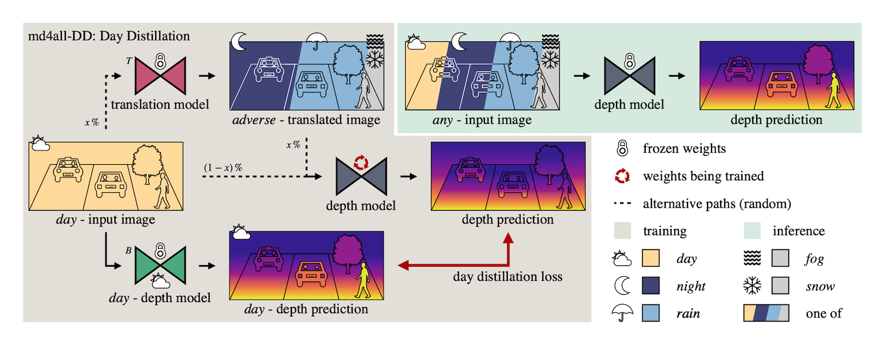

# md4all
Source code for the ICCV 2023 paper: [Robust Monocular Depth Estimation under Challenging Conditions](Todo)

Authors: [Stefano Gasperini*](https://www.cs.cit.tum.de/camp/members/external-phd-students/stefano-gasperini/),
[Nils Morbitzer*](https://www.linkedin.com/in/nils-morbitzer-7572a321b),
[HyunJun Jung](https://www.cs.cit.tum.de/camp/members/hyunjun-jung/),
[Nassir Navab](https://www.cs.cit.tum.de/camp/members/cv-nassir-navab/nassir-navab/),
and [Federico Tombari](https://federicotombari.github.io/)

*equal contribution

\[[Project Page](https://md4all.github.io/)\]
\[[arXiv](Todo)\]


Our approach md4all is a simple and effective solution that works reliably under both adverse and ideal conditions and for different types of learning supervision. We achieve this by exploiting the already proven efficacy of existing architectures and losses under perfect settings. Therefore, we strive to provide valid training signals independently of what is given as input.




Please contact Stefano Gasperini (stefano.gasperini@tum.de) or Nils Morbitzer (nils.morbitzer@tum.de) if you have any questions!


We provide PyTorch code for the self-supervised monodepth2 using md4all and plan to upload it for the fully-supervised AdaBins as well.


<br />

--------------------------------------
## Citation

If you find our code useful for your research, please cite:
```
@inproceedings{gasperini_morbitzer2023md4all,
  title={Robust Monocular Depth Estimation under Challenging Conditions},
  author={Gasperini, Stefano and Morbitzer, Nils and Jung, HyunJun and Navab, Nassir and Tombari, Federico},
  booktitle={Proceedings of the IEEE/CVF International Conference on Computer Vision},
  year={2023}
}
```


<br />

--------------------------------------
## Installation

This code is developed with Python3 (python3) with Cuda 11.3. All models were trained on a single RTX3090 (or RTX4090) GPU with 24GB of memory:
- We recommend to use Docker to set up the environment for better reproducibility.
  1. To make it as easy as possible, we provide a Makefile that needs to be changed at three locations:
    - l. 26: Change <USER_ID>:<GROUP_ID> to your user and group id.
    - l. 33: Change <PATH_TO_DATAROOT> to your host path of the data folder.
    - l. 34: Change <PATH_TO_MD4ALL> to your host path of the md4all code folder.
     Then you can use the provided commands.
  2. Change the directory to:
     ```bash 
     cd <PATH_TO_MD4ALL>
     ```
  3. Build the docker image:
     ```bash 
     make docker-build NAME=build
     ```

- Alternatively, you can also install the environment using Anaconda and pip:
  1. Create a conda environment:  
     ```bash 
     conda create -n md4all python=<PYTHON_VERSION>
     ```
  2. Activate the environment:
     ```bash 
     conda activate md4all
     ```
  3. Change the directory to:
     ```bash 
     cd <PATH_TO_MD4ALL>
     ```
  4. Install the requirements:
     ```bash 
     pip install -r requirements.txt
     ```


<br />

--------------------------------------
## Datasets:

### nuScenes:
1. Download the nuScenes trainval dataset (v1.0) i.e. the 10 file blobs and the metadata from [here](https://www.nuscenes.org/nuscenes). Optionally, you can also download the nuScenes test set from the same location.
2. Download the translated images and the 'train_samples_dynamic.json' file from [here](https://md4all.github.io/).
3. Set everything up such that your file structure look similar to this:
<div style="text-align: center;"></div>
<div style="text-align: center;">nuScenes file tree</div>

### RobotCar:
1. Download the recorded data of the left stereo camera and the front lms laser sensor for the following scenes:
   - 2014/12/09 for day
   - 2014/12/16 for night

2. Download the translated images, the computed poses and the split files from [here](https://md4all.github.io/).

3. Set everything up such that your file structure look similar to this:
<div style="text-align: center;"></div>
<div style="text-align: center;">RobotCar file tree</div>

4. Undistort and demoisaic the images from the left stereo camera (Attention: Using those commands will replace the original distorted and mosaiced images of the left stereo camera):
   - Docker:
     ```bash 
     make docker-precompute-rgb-images-robotcar NAME=precompute-rgb-images-robotcar
     ```
   - Conda:
     ```bash 
     python data/robotcar/precompute_rgb_images.py --dataroot <PATH_TO_DATAROOT> --scenes 2014-12-09-13-21-02 2014-12-16-18-44-24 --camera_sensor stereo/left --out_dir <PATH_TO_DATAROOT>
     ```

5. Precompute the ground truth depth data by projecting the point cloud of the lms front sensor to the images:
   - Docker:
     ```bash 
     make docker-precompute-pointcloud-robotcar NAME=precompute-pointcloud-robotcar
     ```
   - Conda:
     ```bash 
     python data/robotcar/precompute_depth_gt.py --dataroot <PATH_TO_DATAROOT> --scenes 2014-12-09-13-21-02 2014-12-16-18-44-24 --mode val test
     ```


<br />

--------------------------------------
## Evaluation of pre-trained models 

We provide the pre-trained models for md4allDDa on nuScenes and RobotCar [here](https://drive.google.com/drive/folders/1nylOZitf8P33vlq-TKEcGte0FCQQ1wR5?usp=sharing). Download and place them in the checkpoints folder. To evaluate the given pre-trained models (associated with its .yaml config file), run: 

- nuScenes:
    - Docker:
      ```bash
      make docker-eval-md4allDDa-80m-nuscenes-val NAME=eval-md4allDDa-80m-nuscenes-val
      ```
    - Conda:
      ```bash
      python evaluation/evaluation_depth.py --config <PATH_TO_MD4ALL>/config/eval_md4allDDa_80m_nuscenes_val.yaml
      ```

- RobotCar:
  - Docker:
    ```bash
    make docker-eval-md4allDDa-50m-robotcar-test NAME=eval-md4allDDa-50m-robotcar-test
    ```
  - Conda:
    ```bash
    python evaluation/evaluation_depth.py --config <PATH_TO_MD4ALL>/config/eval_md4allDDa_50m_robotcar_test.yaml
    ```


<br />

--------------------------------------
## Training

To train a model e.g. the baseline (associated with its .yaml config file), run: 

- nuScenes:
  - Docker: 
      ```bash
      make docker-train-baseline-nuscenes NAME=train-baseline-nuscenes
      ```
  - Conda:
    ```bash
    python train.py --config <PATH_TO_MD4ALL>/config/train_baseline_nuscenes.yaml
    ```

- RobotCar:
  - Docker: 
      ```bash
      make docker-train-baseline-robotcar NAME=train-baseline-robotcar
      ```
  - Conda:
    ```bash
    python train.py --config <PATH_TO_MD4ALL>/config/train_baseline_robotcar.yaml
    ```


<br />

--------------------------------------
## Q&A
- Permission Denied error when running docker without sudo: To resolve the problem follow the steps [here](https://docs.docker.com/engine/install/linux-postinstall/).
- ModuleNotFoundError: no module named Python Error => Make sure to update your PYTHONPATH accordingly:
  - Docker:
    ```bash
    export PYTHONPATH="${PYTHONPATH}:/mnt/code/md4all"
    ```
  - Conda:
    ```bash
    export PYTHONPATH="${PYTHONPATH}:/path/to/md4all"
    ```
    

<br />

--------------------------------------
## Acknoledgements

Our implementation is based on the [PackNet-SfM repository](https://github.com/TRI-ML/packnet-sfm) and follows their code structure. It also incorporates parts of the [Monodepth2 repository](https://github.com/nianticlabs/monodepth2). Thanks for their great contribution! :)
